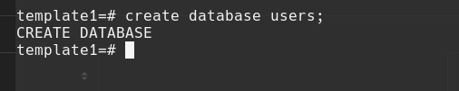
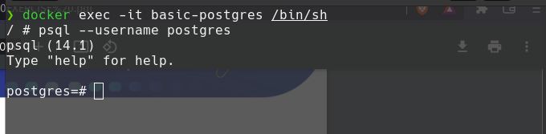
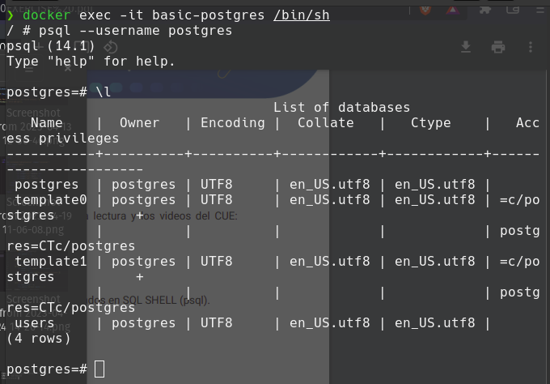

# SQL SHELL

INSTRUCCIONES
- Crear una base de datos desde el Shell de PostgreSQL.

- Crear 1 usuario desde el Shell de PostgreSQL.

- Listar la nueva base de datos creada desde el Shell de postgreSQL.

- Ingresar a la base de datos desde el Shell de postgreSQL.

